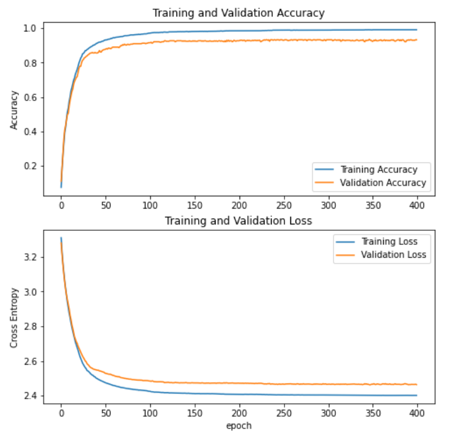
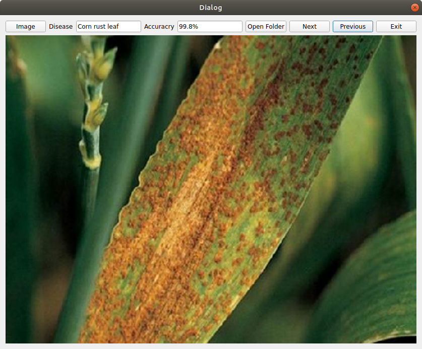
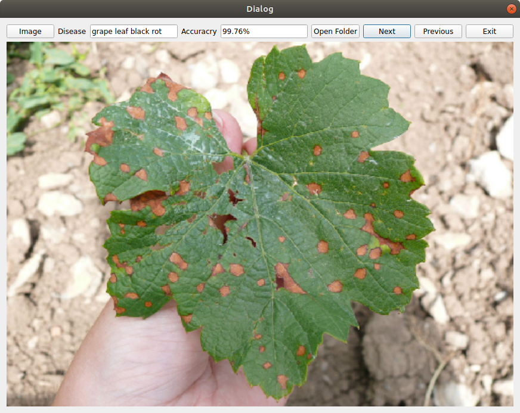

# Plant-Disease-Classification-with-GUI

This Plant Disease Classification with GUI is an model deploying application, where model runs inference on images and classifies plant disease with accuracy.

The model was trained using ResNet50 for classification. 
- Train loss: 2.4018 
- Train accuracy: 99.00 % 
- validation loss: 2.4636 
- validation accuracy: 93.18 %

##### Results:
  

  
### Types of Plants and Diseases - The model classifies:
1. Apple Scab Leaf 
2. Apple leaf
3. Apple rust leaf
4. Bell_pepper leaf
5. Bell_pepper leaf spot
6. Blueberry leaf
7. Cherry leaf
8. Corn Gray leaf spot
9. Corn leaf blight
10. Corn rust leaf
11. Peach leaf
12. Potato leaf early blight
13. Potato leaf late blight
14. Raspberry leaf
15. Soyabean leaf
16. Squash Powdery mildew leaf
17. Strawberry leaf
18. Tomato Early blight leaf
19. Tomato Septoria leaf spot
20. Tomato leaf
21. Tomato leaf bacterial spot
22. Tomato leaf late blight
23. Tomato leaf mosaic virus
24. Tomato leaf yellow virus
25. Tomato mold leaf
26. Tomato two spotted spider mites leaf
27. Grape leaf
28. Grape leaf black rot

##### Sample data:
  

### How to use GUI:
- Clone the repository
- Navigate to the Repo directory.
- Run below command for required libraries.
  ```bash
  . requirements.txt
  ```
- Run following command for GUI:
  ```bash
  python mk1.py
  ```
- You can try widgets in the GUI with ease.


   
### Custom GUI 
 If you want to deploy any classification models through this simple GUI, change the load_model path in mk1.py at line 8 and resize image in get_image function.
 
### Requirements:
 - tf-nightly
 - PyQt5
 - Pillow


